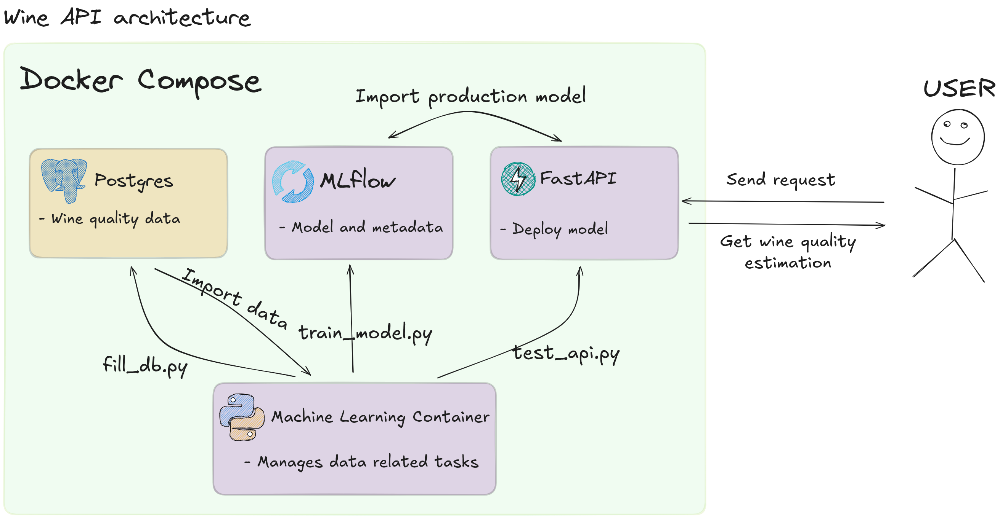
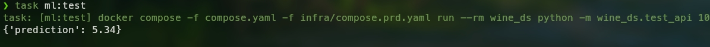

# Wineapp


A wine quality prediction app (mostly a mlflow + fastapi in docker tutorial).


TODO:

- [ ] Améliorer le code sur la partie Machine Learning
- [ ] Lister les axes d'améliorations (gestion des erreurs, test unitaires / intégration)


# **How** to deploy


## Requirements

The modules use python 3.14 or newer. Cleanest way to have it installed is [pyenv](https://github.com/pyenv/pyenv).

Most task are managed and run using [gotask](https://github.com/go-task/task). It is not a hard requirement, commands can be copied and pasted from the `Taskfile.yml` file but it is a lot simpler with gotask.

Every aspect of the project is [dockerised](https://www.docker.com/).

Dependencies are managed with [uv](https://github.com/astral-sh/uv). Pre-commit are also managed using uv.


> [!Note]
>
> Docker is the only real requirement to test the project, python, uv, gotask, etc. are not needed to test since everything is dockerised. They are necessary for working in the project tho.


Summary requirements:

- Pyenv
- Python 3.14
- UV
- Docker
- Gotask


## Project setup

After cloning the repo, pre-commit need to be installed.

```bash
uvx pre-commit install
```


Set the secrets.

```bash
cp infra/secrets/postgres_password.txt.example infra/secrets/postgres_password.txt
cp infra/secrets/pgadmin_password.txt.example infra/secrets/pgadmin_password.txt
```

Then change the values to strong passwords.


Then initialize the project.

```bash
task init
```

This will build the images, fill the database, train a model, then start all containers.


Finally you can test the project.

```bash
task ml:test NUM_WINE=15
```

This should print the result like so :

```
2026-03-15 12:21:36.567 |SUCCESS  |__main__:<module>:46 |La qualité prédite du vin n°15 est de 5.01 | {}
```


## Development guidelines

To build container with dev options :

```bash
task build ENV=dev
```


Then you can get a more comfortable shell with some tools in a container.

```bash
docker compose exec wine_api bash
```


You can start the machine learning container for testing purposes.

```bash
task ml:up ENV=dev
```


## Use the DS container as a development environment

Start the `jupyter` service for the `wine_ds` container.

```bash
task ml:ipykernel
```

Then in a notebook in vscode, click on "Select Kernel", then "Existing Jupyter Server", and enter `http://localhost:8889/?token=mytoken`. Now the container environment can be use to develop from vscode. Using this taking, python is not even required on the dev computer.


# Project architecture


## Data


This is a sample from the data set.

| fixed acidity | volatile acidity | citric acid | residual sugar | chlorides | free sulfur dioxide | total sulfur dioxide | density | pH   | sulphates | alcohol | quality |
| ------------- | ---------------- | ----------- | -------------- | --------- | ------------------- | -------------------- | ------- | ---- | --------- | ------- | ------- |
| 7.4           | 0.7              | 0.0         | 1.9            | 0.076     | 11.0                | 34.0                 | 0.9978  | 3.51 | 0.56      | 9.4     | 5       |
| 7.8           | 0.88             | 0.0         | 2.6            | 0.098     | 25.0                | 67.0                 | 0.9968  | 3.2  | 0.68      | 9.8     | 5       |
| 7.8           | 0.76             | 0.04        | 2.3            | 0.092     | 15.0                | 54.0                 | 0.997   | 3.26 | 0.65      | 9.8     | 5       |
| 11.2          | 0.28             | 0.56        | 1.9            | 0.075     | 17.0                | 60.0                 | 0.998   | 3.16 | 0.58      | 9.8     | 6       |
| 7.4           | 0.7              | 0.0         | 1.9            | 0.076     | 11.0                | 34.0                 | 0.9978  | 3.51 | 0.56      | 9.4     | 5       |
| 7.4           | 0.66             | 0.0         | 1.8            | 0.075     | 13.0                | 40.0                 | 0.9978  | 3.51 | 0.56      | 9.4     | 5       |
| 7.9           | 0.6              | 0.06        | 1.6            | 0.069     | 15.0                | 59.0                 | 0.9964  | 3.3  | 0.46      | 9.4     | 5       |


## Architecture





## Output


When querying the API, we get a json of this format.


