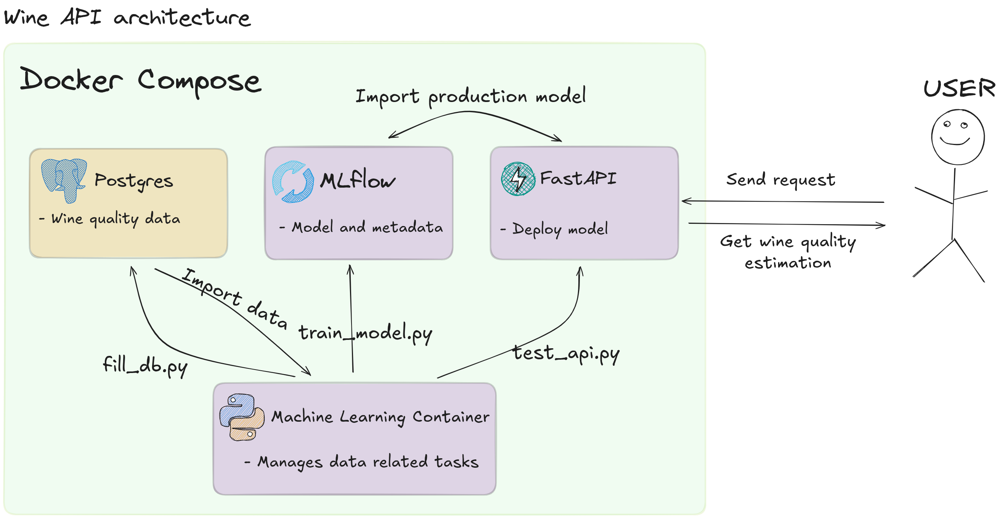

# Wineapp


A wine quality prediction app (mostly a mlflow + fastapi in docker tutorial).


TODO:

- [ ] Améliorer le code sur la partie Machine Learning
- [ ] Ecrire un readme complet
- [ ] Lister les axes d'améliorations (pre-commit, logs, gestion des erreurs, test unitaires / intégration, gestion des secrets)


# How to deploy


From the root folder.

```bash
task init
task start
```


# Set-up the project


## Set-up the script environent


From the `script` directory.

```bash
python -m venv .venv
source .venv/bin/activate
poetry install --no-root
```


Fill up the database.

```bash
python fill_db.py
```


Train a model.

```bash
python train_model.py
```


Test the api (might need to restart the api).

```bash
python test_api.py 10
```

# Project architecture


## Data


This is a sample from the data set.

| fixed acidity | volatile acidity | citric acid | residual sugar | chlorides | free sulfur dioxide | total sulfur dioxide | density | pH   | sulphates | alcohol | quality |
| ------------- | ---------------- | ----------- | -------------- | --------- | ------------------- | -------------------- | ------- | ---- | --------- | ------- | ------- |
| 7.4           | 0.7              | 0.0         | 1.9            | 0.076     | 11.0                | 34.0                 | 0.9978  | 3.51 | 0.56      | 9.4     | 5       |
| 7.8           | 0.88             | 0.0         | 2.6            | 0.098     | 25.0                | 67.0                 | 0.9968  | 3.2  | 0.68      | 9.8     | 5       |
| 7.8           | 0.76             | 0.04        | 2.3            | 0.092     | 15.0                | 54.0                 | 0.997   | 3.26 | 0.65      | 9.8     | 5       |
| 11.2          | 0.28             | 0.56        | 1.9            | 0.075     | 17.0                | 60.0                 | 0.998   | 3.16 | 0.58      | 9.8     | 6       |
| 7.4           | 0.7              | 0.0         | 1.9            | 0.076     | 11.0                | 34.0                 | 0.9978  | 3.51 | 0.56      | 9.4     | 5       |
| 7.4           | 0.66             | 0.0         | 1.8            | 0.075     | 13.0                | 40.0                 | 0.9978  | 3.51 | 0.56      | 9.4     | 5       |
| 7.9           | 0.6              | 0.06        | 1.6            | 0.069     | 15.0                | 59.0                 | 0.9964  | 3.3  | 0.46      | 9.4     | 5       |


## Architecture





## Output


When querying the API, we get a json of this format.


